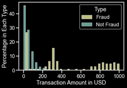
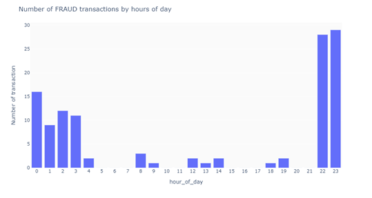
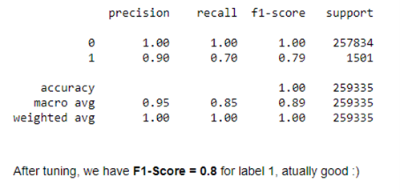

# Credit-Card-Fraud-Detection-Using-Random-Forest
                                    
This repository contains the code and documentation for a machine learning model that uses Random Forest algorithm to detect credit card fraud. This study explored a simulated Credit Card Transactions Fraud Detection Dataset provided by Kaggle (an online dataset repository) covering transactions made with credit cards from 1 January 2019 to 31 December 2020 by 1,000 clients working with a network of 800 merchants.               

    

The findings from the EDA above shows that legitimate transactions tend to be around $200 or less, while fraudulent transactions peak around $300, and then again at the range $800 - $1000. This is a clear pattern showing that most fraudulent transactions tend to withdraw a significant sum at once, as they may not have the opportunity for a second trial. 

                          
It also shows from the chart that while normal transactions distribute more or less equally during the day, credit card frauds occur predominantly around midnight when people are mostly asleep.     
           
A random forest architecture was the preferred tool adopted to train the model by tuning the model hyperparameters in order to achieve the best performance.      
      
## Requirements     
Python 3.x        
scikit-learn        
pandas        
numpy   
Seaborn     
Matplotlib        
          
## Usage            
### Clone this repository to your local machine.                 
```bash
git clone https://github.com/obinopaul/Credit-Card-Fraud-Detection-Using-Random-Forest.git 
```
      
### Install the required packages.                                                   
```bash
pip install -r requirements.txt
```
      
### Run the Jupyter notebook file credit_card_fraud_detection.ipynb to train the model and make predictions on new data.                                 
### The notebook contains detailed instructions and explanations of the code.                                    
    
## Dataset                                                               
The dataset used to train and test the model is the Credit Card Fraud Detection dataset from [Kaggle](https://www.kaggle.com/datasets/kartik2112/fraud-detection?datasetId=817870&sortBy=voteCount). It contains a simulated Credit Card Transactions Fraud Detection Dataset. Transactions from the dates 1 January 2019 to 31 December 2020 are included in the simulated dataset, both genuine and fraudulent. It covers transactions made with credit cards by 1,000 clients working with a network of 800 merchants (Shenoy 2020). 

## Results                                             
The model achieved an accuracy of 99.94% on the test set. Additionally, the model was able to detect fraud with high precision and recall.

## Note                                                    
This is a simplified version of the Credit Card Fraud Detection problem, just for demonstration purposes. In the real world scenario, the dataset would be much more complex and the model would have to be fine-tuned and optimized to work with it.

Please feel free to use the code and dataset in this repository for your own research or projects. If you have any questions or suggestions, please open an issue or pull request.

## References                                                                      
[Credit Card Fraud Detection Dataset](https://www.kaggle.com/datasets/kartik2112/fraud-detection?datasetId=817870&sortBy=voteCount)

